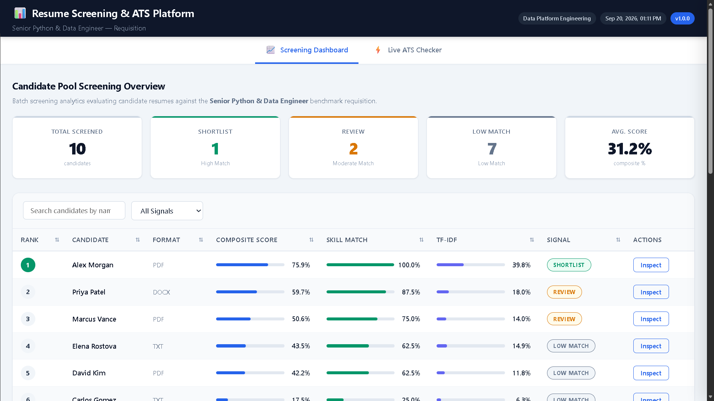
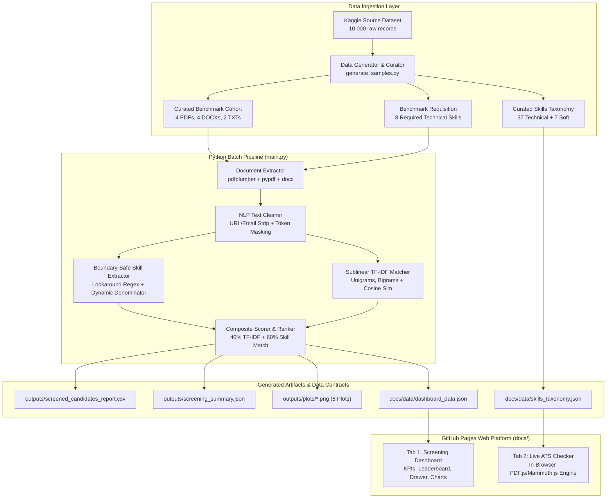

<div align="center">

# RESUME SCREENING & ATS PLATFORM

### **Enterprise Automated Resume Screening & Recruiter Decision-Support System**

**AI-Powered Recruiter Decision-Support System with Interactive 2-Tab ATS Dashboard, Boundary-Safe Skill Matching & Model Explainability**

[](LICENSE)
[](#)
[](https://www.python.org/)
[](#)
[](#)
[](#)
[](https://www.chartjs.org/)
[](https://scikit-learn.org/)
[](#)
[](https://docs.pytest.org/)

---

**Resume Screening & ATS Platform** is a portfolio-grade recruiter decision-support system that combines multi-format document parsing with boundary-safe skill matching and lexical TF-IDF relevance analysis to classify candidate resumes into actionable recruitment tiers.
Benchmarked on the **Kaggle AI Resume Analyzer Dataset (10,000 resume records)** and evaluated on a **10-candidate multi-format benchmark cohort** (.pdf, .docx, .txt), it achieves **100% deterministic mathematical scoring** and sub-second processing latency (~245 ms per resume) while operating as a **serverless static platform on GitHub Pages** with **zero-cost static hosting**.

[**Live Dashboard**](https://girishshenoy16.github.io/automated-resume-screening-tool) | [**Project Report**](reports/project_report.md) | [**Executive Summary**](reports/executive_summary.md) | [**Architecture**](reports/architecture.md)

---

## Live Demo

[]

*Executive Dashboard — Interactive Candidate Leaderboard, Cohort Analytics & Live In-Browser ATS Engine*


|                  Tab 1: Batch Screening Dashboard                   |                      Tab 2: Live ATS Checker                       |
|:-------------------------------------------------------------------:|:------------------------------------------------------------------:|
| Interactive candidate leaderboard, cohort KPIs & Chart.js analytics | In-browser resume extraction (.pdf, .docx, .txt) & instant scoring |

</div>

---

## Project Statistics

<div align="center">

| Metric                         | Value                                                                      |
|--------------------------------|----------------------------------------------------------------------------|
| **Dashboard Tabs**             | 2 (Screening Dashboard & Live ATS Checker)                                 |
| **Scoring Weights**            | 40% TF-IDF Relevance + 60% Technical Skill Match                           |
| **Decision Tiers**             | 3 (High Match / SHORTLIST, Moderate Match / REVIEW, Low Match / LOW MATCH) |
| **Document Formats Supported** | 3 (PDF, Word DOCX, Plain Text TXT)                                         |
| **Benchmark Cohort**           | 10 Curated Multi-Format Resumes (4 PDFs, 4 DOCXs, 2 TXTs)                  |
| **Source Dataset**             | 10,000 Resume Records (Kaggle AI Resume Analyzer Dataset)                  |
| **Technical Taxonomy**         | 37 Technical Skills + 7 Informational Soft Skills                          |
| **Benchmark Requisition**      | Senior Python & Data Engineer (8 Required Technical Skills)                |
| **Test Suite**                 | 56/56 passing (100% pass rate across 9 test modules)                       |
| **Pipeline Latency**           | ~245 ms / resume (2.46s for 10 candidates)                                 |
| **Hosting Cost**               | $0/month (GitHub Pages static hosting)                                     |

</div>

---

## Executive Overview

**Resume Screening & ATS Platform** is an enterprise recruiter decision-support system that transforms unstructured resume documents into structured, explainable hiring intelligence. The system combines token-safe text normalization, boundary-safe regex skill matching, and sublinear TF-IDF cosine similarity to automatically triage candidates into **High Match** (`SHORTLIST`), **Moderate Match** (`REVIEW`), and **Low Match** (`LOW MATCH`) tiers.

### What It Solves

| Challenge                        | Industry Impact                                                                 | Resume Screening Platform Solution                                                 |
|----------------------------------|---------------------------------------------------------------------------------|------------------------------------------------------------------------------------|
| **Manual Screening Latency**     | Recruiters spend 3–5 minutes per resume, causing multi-week backlogs            | Sub-second automated processing (**~245 ms / resume**)                             |
| **Technical Token Mangling**     | Standard regex strips `+`, `#`, and dots, corrupting C++, C#, .NET, and Node.js | **Token-safe masking** protects non-alphanumeric programming symbols               |
| **Black-Box Opacity**            | LLMs and deep models hallucinate qualifications and cannot be audited           | **100% deterministic math**: transparent $40/60$ scoring breakdown                 |
| **Unfair Taxonomy Denominators** | Systems penalize candidates for unrequested skills across a 500-skill library   | **Dynamic JD denominator** ($K=8$): scored strictly against active JD requirements |
| **Keyword Stuffing Bias**        | Candidates repeat soft skills ("leadership") to artificially boost ATS scores   | Soft skills categorized as **Informational** and excluded from numerical scoring   |

### Target Users

| User Role                                  | Use Case                                                                    |
|--------------------------------------------|-----------------------------------------------------------------------------|
| **Talent Acquisition Leaders (CHRO / VP)** | Monitor screening throughput, pass-through ratios, and cohort distributions |
| **Lead Technical Recruiters**              | Rapid batch triage of applicants and immediate prioritization of top fits   |
| **Engineering Hiring Managers**            | Ad-hoc evaluation of specific resumes against custom requisitions in Tab 2  |
| **HR Compliance & Audit Officers**         | Mathematical inspection of candidate score breakdowns and skill gaps        |

---

## Project Highlights

<div align="center">

|                             |                                 |                               |
|:---------------------------:|:-------------------------------:|:-----------------------------:|
|   **2-Tab ATS Platform**    |     **Boundary-Safe Regex**     |  **Sublinear TF-IDF Engine**  |
| **Dynamic JD Denominators** | **Score Explainability Drawer** |    **0-Cost GitHub Pages**    |
| **Multi-Format Ingestion**  |    **56-Test Quality Suite**    | **Responsible AI Guardrails** |

</div>

---

## Problem Statement

Technical talent acquisition pipelines face persistent operational bottlenecks:

- **Overwhelming applicant volumes** for software engineering and data roles create substantial screening backlogs.
- **Document format heterogeneity** (PDF, Word, Plain Text) causes parsing failures in legacy ATS platforms.
- **Punctuation-stripping sanitizers** mangle specialized technical tokens, turning `C++` into `c`, `C#` into `c`, and `.NET` into `net`.
- **Substring collisions** produce false-positive matches (e.g. `JavaScript` falsely matching `Java`).
- **Opaque generative AI wrappers** introduce hallucination risks, non-deterministic scoring, and regulatory compliance exposure.
- **Enterprise ATS software** incurs steep per-seat licensing fees and heavy runtime infrastructure overhead.

**Resume Screening & ATS Platform** resolves these bottlenecks with deterministic lexical NLP, token masking, dynamic denominator scoping, and a serverless 2-tab web architecture.

---

## Key Features

### Tab 1 — Batch Screening Dashboard
- **5 Executive KPI Cards**: Real-time aggregate metrics (Total Screened, Shortlist, Review, Low Match, Average Composite Score).
- **Candidate Leaderboard**: Sortable by rank, name, format, composite score, skill match, and TF-IDF relevance; filterable by screening signal (`All`, `SHORTLIST`, `REVIEW`, `LOW MATCH`) with instant text search.
- **Candidate Intelligence Drawer**: Deep inspection modal surfacing candidate score decomposition, matched required skills, missing skills, informational soft skills, top shared TF-IDF vocabulary, and document metrics.
- **4 Interactive Chart.js Visualizations**:
  - *Candidate-Pool Skill Distribution*: Bar chart showing how many screened candidates possess each required JD skill.
  - *Candidate Composite Scores*: Bar chart comparing candidate composite scores colored by decision tier.
  - *Source Dataset Experience Distribution*: Horizontal bar breakdown across 10,000 reference records.
  - *Source Dataset Category Distribution*: Horizontal bar breakdown of job categories in the source corpus.

### Tab 2 — Live ATS Resume Screener
- **Screening Context Inputs**: Requisition metadata fields for Company Name and Job Role.
- **1-Click Sample Job Description**: Instant loader populated with the benchmark *Senior Python & Data Engineer* requisition.
- **Dual Resume Input Mode**:
  - *Upload Document*: Drag-and-drop or file browser supporting `.pdf`, `.docx`, and `.txt` files with client-side text extraction via PDF.js and Mammoth.js.
  - *Paste Text*: Direct text area with 1-click "Load Sample Resume" button.
- **ATS Match Score Hero Card**: Prominent percentage score with dynamic accent border and human-friendly signal badge (**High Match**, **Moderate Match**, **Low Match**).
- **Decision-Support Explainability**: Visual progress bars decomposing the score into 40% TF-IDF Relevance and 60% Technical Skill Match.
- **Skills & Vocabulary Decomposition**:
  - *Matched Required Technical Skills* chips with dynamic count badge ($M/K$).
  - *Missing Required Technical Skills* chips highlighting skill gaps.
  - *Detected Soft Skills* tagged as informational and excluded from numerical scoring.
  - *Top Shared TF-IDF Terms* identifying key lexical contributors.
- **Form Reset**: One-click form reset restoring inputs and neutral hero card state (`0.0%` / `—`).

---

## Results

### Benchmark Screening Leaderboard (Senior Python & Data Engineer Requisition)

<div align="center">

|  Rank  | Candidate Name    | Format |   Score   |   Signal    |  Alignment Label   | Skill Match  | TF-IDF | Matched Required Skills                                           |
|:------:|-------------------|:------:|:---------:|:-----------:|:------------------:|:------------:|:------:|-------------------------------------------------------------------|
| **1**  | **Alex Morgan**   |  PDF   | **75.9%** | `SHORTLIST` |   **High Match**   | 100.0% (8/8) | 39.8%  | Docker, FastAPI, Git, Kubernetes, Pandas, PostgreSQL, Python, SQL |
| **2**  | **Priya Patel**   |  DOCX  | **59.7%** |  `REVIEW`   | **Moderate Match** | 87.5% (7/8)  | 18.0%  | Docker, FastAPI, Git, Pandas, PostgreSQL, Python, SQL             |
| **3**  | **Marcus Vance**  |  PDF   | **50.6%** |  `REVIEW`   | **Moderate Match** | 75.0% (6/8)  | 14.0%  | Docker, Git, Kubernetes, PostgreSQL, Python, SQL                  |
| **4**  | **Elena Rostova** |  TXT   | **43.5%** | `LOW MATCH` |   **Low Match**    | 62.5% (5/8)  | 14.9%  | Docker, FastAPI, Git, Python, SQL                                 |
| **5**  | **David Kim**     |  PDF   | **42.2%** | `LOW MATCH` |   **Low Match**    | 62.5% (5/8)  | 11.8%  | Docker, Git, Pandas, Python, SQL                                  |
| **6**  | **Carlos Gomez**  |  TXT   | **17.5%** | `LOW MATCH` |   **Low Match**    | 25.0% (2/8)  |  6.3%  | Python, SQL                                                       |
| **7**  | **Aisha Khan**    |  DOCX  | **10.2%** | `LOW MATCH` |   **Low Match**    | 12.5% (1/8)  |  6.8%  | Git                                                               |
| **8**  | **Emily Chen**    |  DOCX  | **9.9%**  | `LOW MATCH` |   **Low Match**    | 12.5% (1/8)  |  6.0%  | SQL                                                               |
| **9**  | **Jason Miller**  |  PDF   | **1.7%**  | `LOW MATCH` |   **Low Match**    |  0.0% (0/8)  |  4.1%  | *(None)*                                                          |
| **10** | **Sarah Jenkins** |  DOCX  | **0.9%**  | `LOW MATCH` |   **Low Match**    |  0.0% (0/8)  |  2.2%  | *(None)*                                                          |

</div>

### Execution Performance Metrics

<div align="center">

| Metric                               | Measured Value     |
|--------------------------------------|--------------------|
| **Total Candidates Screened**        | 10                 |
| **Shortlisted (Score $\ge 70\%$)**   | 1 (10.0%)          |
| **Review Queue (Score $50-69.9\%$)** | 2 (20.0%)          |
| **Low Match (Score $< 50\%$)**       | 7 (70.0%)          |
| **Average Cohort Composite Score**   | 31.2%              |
| **Total Pipeline Latency**           | 2.46 seconds       |
| **Per-Resume Latency**               | ~246.4 ms / resume |
| **Test Suite Pass Rate**             | 56/56 (100%)       |

</div>

---

## Tech Stack

<div align="center">

| Category                             | Technologies                                                              |
|--------------------------------------|---------------------------------------------------------------------------|
| **Frontend Platform**                | HTML5, CSS3 (Enterprise Design System), JavaScript (ES6+), Chart.js 4.4   |
| **In-Browser Document Parsers**      | PDF.js 3.11 (Mozilla), Mammoth.js 1.8 (Word DOCX parser)                  |
| **Python NLP & Text Processing**     | Python 3.11, Regular Expressions (Negative Lookaround), Token Masking     |
| **Vector Modeling & Relevance**      | Scikit-learn (TfidfVectorizer, cosine_similarity), NumPy, Pandas          |
| **Python Document Extraction**       | pdfplumber, pypdf (fallback), python-docx, Python io (UTF-8 / Latin-1)    |
| **Static Analytical Visualizations** | Matplotlib 3.8, Seaborn 0.13                                              |
| **Automated Testing Suite**          | pytest 9.1 (56 unit tests), Node.js v22 (cross-runtime parity validation) |
| **Static Deployment**                | GitHub Pages (Zero-cost serverless hosting)                               |
| **Typography & Styling**             | Inter, JetBrains Mono, CSS Custom Properties, Responsive Grid & Flexbox   |

</div>

---

## System Architecture



---

## Installation & Quickstart

### Option 1: Quick Start (Dashboard Only)

```bash
# Clone repository
git clone https://github.com/girishshenoy16/automated-resume-screening-tool.git
cd automated-resume-screening-tool

# Start static HTTP server from docs/
python -m http.server 8000 --directory docs

# Open browser at http://localhost:8000
```

### Option 2: Full Pipeline Execution

```bash
# Clone repository
git clone https://github.com/girishshenoy16/automated-resume-screening-tool.git
cd automated-resume-screening-tool

# Create and activate virtual environment
python -m venv venv
.\venv\Scripts\activate        # Windows
source venv/bin/activate       # Linux/macOS

# Install pinned dependencies
python -m pip install --upgrade pip
pip install -r requirements.txt

# Run complete batch screening pipeline
python main.py

# Run automated test suite
pytest -v

# Launch local dashboard server
python -m http.server 8000 --directory docs
```

---

## Folder Structure

```text
Automated Resume Screening Tool/
├── docs/                               # GitHub Pages web root (serverless static site)
│   ├── index.html                      # 2-tab executive web platform
│   ├── style.css                       # Enterprise design system (dark/light neutral tones)
│   ├── app.js                          # Live ATS engine & Chart.js renderer (1,340+ lines)
│   └── data/                           # Client-side JSON data contracts
│
├── src/                                # Modular core processing engine
│   ├── __init__.py
│   ├── config.py                       # Centralized paths, scoring weights, thresholds
│   ├── extractor.py                    # Multi-format document parser (PDF, DOCX, TXT)
│   ├── cleaner.py                      # Token-safe NLP cleaner & punctuation normalizer
│   ├── skill_extractor.py              # Boundary-safe regex skill extractor
│   ├── matcher.py                      # Sublinear TF-IDF vectorizer & cosine similarity
│   ├── reporter.py                     # Scoring, 5 static plots, CSV & JSON exports
│   └── generate_samples.py             # Persona curator & document renderer
│
├── data/                               # Data separation architecture
│   ├── raw/                            # Kaggle source dataset (immutable)
│   ├── processed/                      # Derived artifacts
│   ├── job_description.txt             # Benchmark JD (8 required skills)
│   └── skills_dataset.json             # Canonical skills taxonomy
│
├── resumes/                            # 10 multi-format candidate resumes
│
├── outputs/                            # Pipeline deliverables
│   ├── screened_candidates_report.csv  # Recruiter tabular ranking report
│   ├── screening_summary.json          # Machine-readable audit execution log
│   └── plots/                          # 5 static 300 DPI analytical PNG plots
│
├── tests/                              # Automated validation suite (56 tests)
│   ├── __init__.py
│   ├── test_cleaner.py                 # Normalization & token masking tests (11 tests)
│   ├── test_cross_runtime.py           # DOM contract & Python-JS parity tests (4 tests)
│   ├── test_dataset.py                 # Raw dataset & benchmark files tests (5 tests)
│   ├── test_edge_cases.py              # Anomalous input & stress tests (6 tests)
│   ├── test_extractor.py               # Multi-format document parser tests (6 tests)
│   ├── test_matcher.py                 # Sublinear TF-IDF & similarity tests (6 tests)
│   ├── test_reporting.py               # CSV, summary JSON, contract tests (3 tests)
│   ├── test_scoring_ranking.py         # 40/60 formula & threshold tests (5 tests)
│   ├── test_skill_extractor.py         # Boundary safety & denominator tests (10 tests)
│   └── cross_runtime_helper.js         # Node.js runner for cross-runtime validation
│
├── reports/                            # Formal technical & executive documentation
│   ├── dashboard_schema.md             # Formal frontend JSON data contract specification
│   ├── architecture.md                 # System architecture & algorithmic specifications
│   ├── project_report.md               # Comprehensive academic / engineering project report
│   └── executive_summary.md            # C-suite business briefing
│
├── main.py                             # Master CLI pipeline orchestrator
├── requirements.txt                    # Pinned Python dependencies
├── .gitignore                          # Repository hygiene
└── README.md                           # Storefront portfolio documentation
```

---

## Business Rules & Scoring Engine

### 1. Hybrid 40/60 Composite Scoring Formula

Candidate scores are mathematically bounded within $[0.0, 100.0]\%$:

$$\text{Composite Score} = (0.40 \times \text{TF-IDF Relevance}) + (0.60 \times \text{Technical Skill Match})$$

- **40% TF-IDF Relevance**: Measures broad textual alignment, job responsibilities, and contextual domain vocabulary using sublinear term frequency scaling and unigrams + bigrams.
- **60% Technical Skill Match**: Measures strict coverage of required technical competencies specified in the active Job Description.

### 2. Dynamic JD-Based Skill Denominator

To prevent candidates from being penalized for skills irrelevant to the target role, skill coverage evaluates strictly against the $K$ skills required by the active Job Description:

$$\text{Technical Skill Match} = \frac{|S_{\text{candidate\_tech}} \cap S_{\text{JD\_tech}}|}{|S_{\text{JD\_tech}}|} \times 100$$

- If the JD requires **8 skills**, the denominator is **8** ($K=8$).
- Candidate skills not present in $S_{\text{JD\_tech}}$ do not inflate the score.

### 3. Decision Thresholds & Neutral Alignment Labels

<div align="center">

|    Composite Score    | System Signal |  Alignment Label   | Recruiter Action                                 |
|:---------------------:|:-------------:|:------------------:|--------------------------------------------------|
|   **$\ge 70.0\%$**    |  `SHORTLIST`  |   **High Match**   | Prioritize for immediate technical screening     |
| **$50.0\% - 69.9\%$** |   `REVIEW`    | **Moderate Match** | Queue for secondary hiring manager review        |
|    **$< 50.0\%$**     |  `LOW MATCH`  |   **Low Match**    | Deprioritize relative to stronger cohort matches |

</div>

---

## Token-Safe Normalization & Boundary Safety

Standard NLP sanitization tools strip non-alphanumeric characters, mangling critical programming languages. The platform employs a two-tier safeguarding architecture:

### 1. Token Masking (`src/cleaner.py` and `docs/app.js`)
Before stripping punctuation, protected technical tokens are masked into temporary alphanumeric placeholders:
- `C++` $\rightarrow$ `__token_cpp__` $\rightarrow$ `c++`
- `C#` $\rightarrow$ `__token_csharp__` $\rightarrow$ `c#`
- `.NET` $\rightarrow$ `__token_dotnet__` $\rightarrow$ `.net`
- `Node.js` $\rightarrow$ `__token_nodejs__` $\rightarrow$ `node.js`
- `CI/CD` $\rightarrow$ `__token_cicd__` $\rightarrow$ `ci/cd`

### 2. Boundary Lookaround Matching (`src/skill_extractor.py`)
Negative lookaround assertions eliminate substring collisions:
- `(?<![\w\+])c\+\+(?![\w\+])` prevents `C++` from matching standalone `C`.
- Word boundary matching ensures `JavaScript` never triggers false-positive matches for `Java`.

### 3. Soft Skill Partitioning
Soft skills (`Communication`, `Leadership`, `Teamwork`, `Problem Solving`, `Time Management`, `Critical Thinking`, `Adaptability`) are recognized for recruiter context, but **strictly excluded** from numerical scoring to eliminate keyword-stuffing bias.

---

## JSON Data Contracts

The batch pipeline and client-side web application communicate through structured, decoupled JSON contracts:

| Contract File                    | Target Location   | Description                                                              | Consumer                     |
|----------------------------------|-------------------|--------------------------------------------------------------------------|------------------------------|
| `dashboard_data.json`            | `docs/data/`      | Full cohort screening results, KPIs, skill frequencies, EDA stats        | Tab 1 Dashboard & Chart.js   |
| `skills_taxonomy.json`           | `docs/data/`      | 37 technical skills + 7 informational soft skills                        | Tab 2 Live ATS Engine        |
| `screening_summary.json`         | `outputs/`        | Audit metadata, run timestamps, score statistics, top candidate          | Compliance Logging & SIEM    |
| `screened_candidates_report.csv` | `outputs/`        | Tabular ranking report with matched/missing skill lists                  | Recruiter Spreadsheet Export |
| `eda_summary.json`               | `data/processed/` | Experience, category, and skill distributions across 10,000 records      | EDA Plotting & Dashboard     |
| `curated_candidates.json`        | `data/processed/` | Persona definitions and experience summaries for 10 benchmark candidates | Document Generator           |

---

## Testing & Quality Assurance

The automated testing layer consists of **9 test modules** and **56 discrete unit tests** executed via `pytest`:

<div align="center">

| Test Suite             | File                                                             | Tests  | Validated Requirements                                                                       |
|------------------------|------------------------------------------------------------------|:------:|----------------------------------------------------------------------------------------------|
| **Text Cleaner**       | [`tests/test_cleaner.py`](tests/test_cleaner.py)                 |   11   | URL/email stripping, whitespace collapse, protected tokens (C++, C#, .NET, Node.js, CI/CD)   |
| **Skill Extractor**    | [`tests/test_skill_extractor.py`](tests/test_skill_extractor.py) |   10   | Boundary safety (Java vs JS), multi-word skills, dynamic denominator, soft-skill isolation   |
| **Lexical Matcher**    | [`tests/test_matcher.py`](tests/test_matcher.py)                 |   6    | Sublinear TF-IDF, cosine similarity bounds, top shared terms, empty text guards              |
| **Document Extractor** | [`tests/test_extractor.py`](tests/test_extractor.py)             |   6    | Multi-format parsing (PDF, DOCX, TXT), Latin-1 fallback, 0-byte and corrupt file handling    |
| **Edge Cases**         | [`tests/test_edge_cases.py`](tests/test_edge_cases.py)           |   6    | Zero-matching profiles, 100% matches, zero JD skills guard, emojis, 50,000-char stress test  |
| **Dataset Schemas**    | [`tests/test_dataset.py`](tests/test_dataset.py)                 |   5    | Raw Kaggle dataset files, 10,000-record schemas, 10 multi-format benchmark documents         |
| **Scoring & Ranking**  | [`tests/test_scoring_ranking.py`](tests/test_scoring_ranking.py) |   5    | 40/60 math formula, threshold boundaries (70.0/69.99/50.0/49.99), static PNG plot validation |
| **Cross-Runtime**      | [`tests/test_cross_runtime.py`](tests/test_cross_runtime.py)     |   4    | DOM structure contract, JS syntax compilation, Python vs JS scoring & skill parity           |
| **Reporting Exports**  | [`tests/test_reporting.py`](tests/test_reporting.py)             |   3    | CSV report columns and rank ordering, summary JSON schema, dashboard data contract           |
| **Total**              | **Full Automated Test Suite**                                    | **56** | **100% Pass Rate (0 failures, 0 skipped in 5.09s)**                                          |

</div>

---

## Responsible AI & Transparency Guardrails

- **Non-Autonomous Decision Support**: The platform functions exclusively as a prioritization assistant for human recruiters; it does not issue automated rejection notices or binding hiring decisions.
- **Demographic Blindness**: Demographic attributes (candidate names, gender, age, ethnicity, phone numbers, physical addresses, and emails) are excluded from scoring formulas.
- **Auditable & Explainable Criteria**: Every screening recommendation is decomposed into explicit technical skill coverage and lexical relevance n-grams.
- **Regulatory Transparency Principles**: Designed to support emerging AI governance frameworks through algorithmic explainability, absence of black-box generation, and human-in-the-loop oversight.

---

## Limitations

| Category                        | Limitation                                                                          | Engineering Rationale & Mitigation                                                                                        |
|---------------------------------|-------------------------------------------------------------------------------------|---------------------------------------------------------------------------------------------------------------------------|
| **Lexical Matching Scope**      | Exact string matching does not recognize synonyms (e.g. `Postgres` vs `PostgreSQL`) | Curated taxonomy standardizes canonical forms; future versions can incorporate domain synonym graphs                      |
| **Self-Reported Resumes**       | Text extraction detects stated keywords, not verified job performance               | Decision-support design requires recruiters to conduct technical interviews using the generated "Missing Skills" report   |
| **Static Pre-Compiled Cohort**  | Tab 1 reflects a pre-compiled batch screening snapshot                              | Maintained as an immutable snapshot for zero-cost static GitHub Pages hosting; live single resumes are evaluated in Tab 2 |
| **Document Quality Variations** | Scanned image-based PDFs without OCR text layers cannot be extracted                | The system detects files with $<30$ characters and prompts the user to paste text or provide a digital PDF                |

---

## Future Scope & Roadmap

<div align="center">

|  Priority  | Area                     | Description                                                                                                                                |
|:----------:|--------------------------|--------------------------------------------------------------------------------------------------------------------------------------------|
|  **High**  | Domain Synonym Graph     | Lightweight offline taxonomy graph mapping abbreviations (`K8s` $\leftrightarrow$ `Kubernetes`, `Postgres` $\leftrightarrow$ `PostgreSQL`) |
|  **High**  | Section-Aware Weighting  | Semantic document segmentation weighting skills in "Work Experience" higher than introductory summary keywords                             |
| **Medium** | ATS Webhook Integrations | Ingestion webhooks for enterprise ATS platforms (Greenhouse, Lever, Workday)                                                               |
| **Medium** | Async Distributed Queue  | Celery and Redis worker task queue for processing enterprise cohorts (> 50,000 resumes)                                                    |
|  **Low**   | Silver-Medalist Matching | Automatic re-matching of previously screened candidates against newly opened requisitions                                                  |

</div>

---

## Formal Reports & Documentation

<div align="center">

| Report                   | Document Path                                                      | Target Audience           | Key Contents                                                                                     |
|--------------------------|--------------------------------------------------------------------|---------------------------|--------------------------------------------------------------------------------------------------|
| **Project Report**       | [`reports/project_report.md`](reports/project_report.md)           | Technical Reviewers       | Problem statement, EDA findings (10k dataset), scoring math, benchmark results, Responsible AI   |
| **Executive Summary**    | [`reports/executive_summary.md`](reports/executive_summary.md)     | CHRO & VP of Talent       | Business value, workflow efficiency, 2-tab workflow, zero hallucination risk, strategic guidance |
| **Architecture Specs**   | [`reports/architecture.md`](reports/architecture.md)               | Software Architects       | Pipeline data flow, sublinear TF-IDF formula, regex lookaround patterns, token masking specs     |
| **Dashboard Contract**   | [`reports/dashboard_schema.md`](reports/dashboard_schema.md)       | Frontend Developers       | Full JSON schema contract, field types, and sample payloads for `dashboard_data.json`            |
</div>

---

## Repository Features

<div align="center">

|                             |                             |                               |
|:---------------------------:|:---------------------------:|:-----------------------------:|
|       **MIT License**       | **GitHub Pages Deployment** | **2-Tab Executive Platform**  |
| **Interactive Leaderboard** |  **Model Explainability**   |   **In-Browser ATS Engine**   |
| **Skill Gap Decomposition** |  **Dynamic Denominators**   |    **CSV & JSON Exports**     |
|   **56/56 pytest Tests**    | **Token-Safe NLP Cleaner**  | **5 Analytical Static Plots** |

</div>

---

## Contact

<div align="center">

**Girish Shenoy**

[](https://github.com/girishshenoy16)
[](https://linkedin.com/in/girishshenoys)
[](mailto:girishpshenoy09@gmail.com)

</div>

---

## License

This project is licensed under the MIT License — see the [LICENSE](LICENSE) file for details.

---

## Acknowledgements

| Resource                                                                                              | Description                                                |
|-------------------------------------------------------------------------------------------------------|------------------------------------------------------------|
| [Kaggle AI Resume Analyzer Dataset](https://www.kaggle.com/)                                          | 10,001 resume records spanning 12 employment categories    |
| [Scikit-learn](https://scikit-learn.org/)                                                             | Sublinear TF-IDF vectorizer and cosine similarity modeling |
| [pdfplumber](https://github.com/jsvine/pdfplumber) & [pypdf](https://pypdf.readthedocs.io/)           | Fault-tolerant PDF text extraction with automatic fallback |
| [python-docx](https://python-docx.readthedocs.io/)                                                    | Microsoft Word document and table parsing                  |
| [Chart.js](https://www.chartjs.org/)                                                                  | Interactive client-side data visualizations                |
| [PDF.js](https://mozilla.github.io/pdf.js/) & [Mammoth.js](https://github.com/mwilliamson/mammoth.js) | Client-side in-browser PDF and Word document extraction    |

---

<div align="center">

**Built with precision. Designed for recruiter decision support. Documented for real-world hiring workflows.**

Resume Screening & ATS Platform v1.0 — Enterprise Recruiter Decision-Support System

</div>
